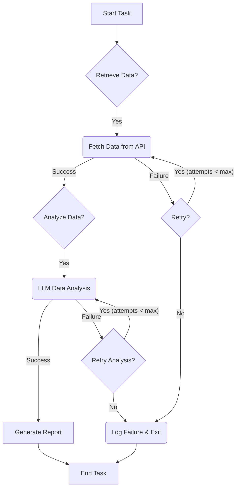

<!-- keywords: AI agent resilience, LLM agent error handling, durable AI workflows, agent state management, retry logic for AI, fault-tolerant AI systems, reliable LLM agents, AI task orchestration -->

<div style="background-color: #e6f7ff; border-left: 5px solid #2db7f5; padding: 15px; margin-bottom: 20px;">
    <h3 style="margin-top: 0; color: #2db7f5;">Quick Answer / TL;DR</h3>
    <p>
        Building reliable AI agents requires proactive strategies for <b>AI Agent Failure Recovery</b>. The core mechanisms include implementing <b>checkpoints</b> to save agent state, setting intelligent <b>timeouts</b> to prevent indefinite waits, and adopting <b>durable execution patterns</b> like retries with exponential backoff and message queues to ensure tasks are completed despite transient errors or system interruptions. These techniques collectively enable agents to resume operations gracefully and maintain operational integrity.
    </p>
</div>

As AI agents become increasingly sophisticated and autonomous, their reliability in real-world scenarios is paramount. Whether orchestrating complex workflows, interacting with external APIs, or performing multi-step reasoning, agents are prone to various failures – from transient network glitches and API rate limits to unexpected LLM responses and intricate logical deadlocks. Without robust **AI Agent Failure Recovery** mechanisms, these systems can become brittle, leading to incomplete tasks, wasted resources, and frustrated users. This guide delves into practical strategies like checkpoints, timeouts, and durable execution patterns to build more resilient and trustworthy AI agents.

### What You Will Learn

*   How to identify common failure modes in AI agent architectures.
*   Practical implementation of checkpointing to preserve agent state and enable seamless recovery.
*   Techniques for setting effective timeouts to manage agent responsiveness and prevent resource exhaustion.
*   Designing durable execution patterns using retry mechanisms and message queues for fault-tolerant workflows.
*   Integrating these strategies into a comprehensive framework for building highly reliable AI agents.

### Table of Contents

*   [Understanding AI Agent Fragility](#understanding-ai-agent-fragility)
*   [Implementing Checkpointing for State Preservation](#implementing-checkpointing-for-state-preservation)
    *   [What Constitutes Agent State?](#what-constitutes-agent-state)
    *   [Checkpointing Strategy and Implementation](#checkpointing-strategy-and-implementation)
*   [Setting Up Timeouts for Unresponsive Agents](#setting-up-timeouts-for-unresponsive-agents)
    *   [Types of Timeouts](#types-of-timeouts)
    *   [Implementing Timeouts in Python](#implementing-timeouts-in-python)
*   [Designing Durable Execution Patterns](#designing-durable-execution-patterns)
    *   [Retry Mechanisms with Exponential Backoff](#retry-mechanisms-with-exponential-backoff)
    *   [Leveraging Message Queues for Durable Tasks](#leveraging-message-queues-for-durable-tasks)
    *   [Orchestration for Long-Running Workflows](#orchestration-for-long-running-workflows)
*   [A Holistic Approach to AI Agent Failure Recovery](#a-holistic-approach-to-ai-agent-failure-recovery)
*   [Conclusion](#conclusion)
*   [FAQ](#faq)
*   [Further Reading](#further-reading)

---

## Understanding AI Agent Fragility

AI agents, particularly those leveraging Large Language Models (LLMs), operate in complex environments. Their decision-making processes often involve chains of thought, external tool calls, and interactions with various APIs and databases. This complexity introduces multiple points of failure:

*   **External API Failures:** Third-party services (e.g., search engines, knowledge bases, task management APIs) can experience outages, rate limiting, or return unexpected data formats.
*   **Network Issues:** Transient network problems can disrupt communication between agent components or with external services.
*   **LLM Hallucinations/Misinterpretations:** The LLM might generate incorrect or nonsensical outputs, leading the agent down an unproductive path.
*   **Logical Deadlocks/Infinite Loops:** A poorly designed agent prompt or internal logic might cause the agent to get stuck in a repetitive loop, unable to progress.
*   **Resource Constraints:** Running out of memory, CPU, or hitting execution time limits can terminate an agent prematurely.
*   **Unexpected Data Inputs:** Real-world data is messy; agents must handle malformed inputs or edge cases gracefully.

Each of these scenarios can halt an agent's progress, leaving tasks unfinished and requiring manual intervention. Implementing robust **AI Agent Failure Recovery** is not just about catching errors; it's about designing systems that can self-heal and continue their work autonomously. This moves us towards building truly resilient AI systems.

## Implementing Checkpointing for State Preservation

When an AI agent's execution is interrupted, the ability to resume from the last known good state is crucial for efficient failure recovery. This is where checkpointing comes into play. Checkpointing involves periodically saving the agent's current state, allowing it to pick up where it left off without starting from scratch.

### What Constitutes Agent State?

The "state" of an AI agent can be multifaceted, depending on its complexity and purpose. Common components of an agent's state include:

*   **Conversation History:** The sequence of user prompts and agent responses.
*   **Internal Monologue/Thought Process:** The LLM's intermediate reasoning steps.
*   **Tool Call History:** Records of external tools invoked and their results.
*   **Working Memory/Scratchpad:** Temporary data or facts the agent has gathered.
*   **Task Progress:** Which sub-tasks have been completed, and which are pending.
*   **User Preferences/Session Data:** Any personalized information relevant to the current session.

### Checkpointing Strategy and Implementation

The frequency and granularity of checkpointing depend on the agent's task criticality and the cost of re-computation. For long-running, multi-step tasks, frequent checkpointing is advisable.

**Step 1: Define Your Agent's State Schema**
First, identify all critical pieces of information that define your agent's current progress and decision-making context.

```python
# agents/models.py
from typing import Dict, List, Any
from pydantic import BaseModel, Field
import json

class AgentState(BaseModel):
    task_id: str
    current_step: int = 0
    conversation_history: List[Dict[str, str]] = []
    scratchpad: Dict[str, Any] = {}
    tool_results: List[Dict[str, Any]] = []
    status: str = "running" # e.g., "running", "paused", "completed", "failed"

    def to_json(self) -> str:
        return self.json()

    @classmethod
    def from_json(cls, json_str: str):
        return cls.parse_raw(json_str)

```

**Step 2: Implement Save and Load Functions**
You'll need functions to serialize the agent's state to persistent storage (e.g., a file, database, or key-value store like Redis) and deserialize it back when needed.

```python
# agents/persistence.py
import os
from agents.models import AgentState

def save_agent_state(state: AgentState, storage_path: str = "./agent_checkpoints"):
    os.makedirs(storage_path, exist_ok=True)
    filepath = os.path.join(storage_path, f"{state.task_id}.json")
    with open(filepath, "w") as f:
        f.write(state.to_json())
    print(f"Checkpoint saved for task {state.task_id} at {filepath}")

def load_agent_state(task_id: str, storage_path: str = "./agent_checkpoints") -> AgentState | None:
    filepath = os.path.join(storage_path, f"{task_id}.json")
    if os.path.exists(filepath):
        with open(filepath, "r") as f:
            state_json = f.read()
            print(f"Loading checkpoint for task {task_id}")
            return AgentState.from_json(state_json)
    print(f"No checkpoint found for task {task_id}")
    return None

```

**Step 3: Integrate Checkpointing into Agent Logic**
Periodically save the agent's state at logical points, such as after completing a significant step, before making an important external API call, or at regular time intervals.

```python
# agents/agent_workflow.py
from agents.models import AgentState
from agents.persistence import save_agent_state, load_agent_state
# Assume we have an LLM and tool_executor setup
# from your_llm_library import LLM, ToolExecutor

class MyAgent:
    def __init__(self, task_id: str):
        self.task_id = task_id
        self.state = self._load_or_initialize_state()
        # self.llm = LLM(...)
        # self.tool_executor = ToolExecutor(...)

    def _load_or_initialize_state(self) -> AgentState:
        loaded_state = load_agent_state(self.task_id)
        if loaded_state:
            return loaded_state
        return AgentState(task_id=self.task_id)

    def run(self):
        while self.state.status == "running" and self.state.current_step < 5: # Example: 5 steps
            try:
                print(f"Agent {self.task_id} executing step {self.state.current_step}")
                # Simulate agent work
                if self.state.current_step == 2:
                    print("Simulating a critical step (e.g., API call)...")
                    # raise ValueError("Simulated API error!") # Uncomment to test failure

                # Update agent state based on current step's outcome
                self.state.conversation_history.append({"agent": f"Completed step {self.state.current_step}"})
                self.state.scratchpad[f"result_step_{self.state.current_step}"] = f"Data from step {self.state.current_step}"
                self.state.current_step += 1

                # Checkpoint after each successful step
                save_agent_state(self.state)

            except Exception as e:
                print(f"Error in agent {self.task_id} at step {self.state.current_step}: {e}")
                self.state.status = "failed"
                save_agent_state(self.state) # Save failed state
                break

        if self.state.current_step >= 5:
            self.state.status = "completed"
            save_agent_state(self.state)
            print(f"Agent {self.task_id} completed!")
        elif self.state.status == "failed":
            print(f"Agent {self.task_id} failed. Review checkpoint for recovery.")


# Example usage:
if __name__ == "__main__":
    agent_1 = MyAgent("task_abc_123")
    agent_1.run()

    # Simulate restart for recovery:
    print("\n--- Simulating Agent Restart ---")
    agent_1_restarted = MyAgent("task_abc_123")
    agent_1_restarted.run()
```
*Real-World Example*: An AI agent tasked with planning a multi-city travel itinerary. After each city's accommodation and flight are booked, the agent checkpoints its state, saving confirmed bookings and the remaining cities. If the agent fails while planning for the third city, it can restart and continue from the last successfully booked city, avoiding re-planning from scratch.

Checkpointing significantly enhances an agent's ability to recover from unexpected interruptions, laying the groundwork for more durable execution. However, an agent might get stuck without progressing, even if its state is saved. This is where timeouts become indispensable.

## Setting Up Timeouts for Unresponsive Agents

Even with checkpointing, an agent might encounter situations where it simply hangs, waiting indefinitely for a response that never comes, or entering an unexpected infinite loop. This can consume valuable resources and prevent other tasks from executing. Timeouts are crucial for defining acceptable durations for operations and automatically terminating or retrying them if they exceed these limits.

### Types of Timeouts

*   **Step-level Timeouts:** Apply to individual actions within an agent's workflow, such as an LLM call, an external API request, or a complex local computation.
*   **Overall Task Timeouts:** A global timeout for the entire agent task, ensuring that even if individual steps complete, the whole process doesn't run indefinitely.

### Implementing Timeouts in Python

Python doesn't have a built-in `timeout` parameter for arbitrary code blocks, but you can achieve this using `threading` or `asyncio`.

**Method 1: Using `signal` (Unix-like systems only)**
For simple CPU-bound tasks, `signal.alarm` can raise an exception after a specified time.

```python
# agents/timeouts.py
import signal
import time

class TimeoutException(Exception):
    pass

def timeout_handler(signum, frame):
    raise TimeoutException("Operation timed out!")

def long_running_function(duration):
    signal.signal(signal.SIGALRM, timeout_handler)
    signal.alarm(5) # Timeout after 5 seconds
    try:
        print(f"Starting long operation for {duration} seconds...")
        time.sleep(duration)
        print("Operation completed successfully.")
    except TimeoutException:
        print("Operation was terminated due to timeout.")
    finally:
        signal.alarm(0) # Disable the alarm

if __name__ == "__main__":
    print("--- Test 1: Should complete ---")
    long_running_function(3) # Will complete in 3 seconds

    print("\n--- Test 2: Should timeout ---")
    long_running_function(7) # Will timeout after 5 seconds

```
**Caveat**: `signal` module is not available on Windows and can interfere with other signal handlers.

**Method 2: Using `threading` (Cross-platform for I/O-bound tasks)**
For more general cases, especially involving I/O operations, you can run the timed operation in a separate thread.

```python
# agents/timeouts_thread.py
import threading
import time

class TimeoutException(Exception):
    pass

def run_with_timeout(func, args=(), kwargs={}, timeout_duration=10):
    result = [None]
    exception = [None]

    def target():
        try:
            result[0] = func(*args, **kwargs)
        except Exception as e:
            exception[0] = e

    thread = threading.Thread(target=target)
    thread.start()
    thread.join(timeout=timeout_duration)

    if thread.is_alive():
        raise TimeoutException(f"Function timed out after {timeout_duration} seconds.")
    if exception[0]:
        raise exception[0] # Re-raise any exception from the thread
    return result[0]

def simulate_llm_call(delay):
    print(f"Simulating LLM call for {delay} seconds...")
    time.sleep(delay)
    return "LLM response after delay"

if __name__ == "__main__":
    print("--- Test 1: LLM call within timeout ---")
    try:
        response = run_with_timeout(simulate_llm_call, args=(3,), timeout_duration=5)
        print(f"LLM Response: {response}")
    except TimeoutException as e:
        print(f"Error: {e}")

    print("\n--- Test 2: LLM call exceeding timeout ---")
    try:
        response = run_with_timeout(simulate_llm_call, args=(7,), timeout_duration=5)
        print(f"LLM Response: {response}")
    except TimeoutException as e:
        print(f"Error: {e}")

```
*Real-World Example*: An AI agent uses a third-party image generation API. This API can sometimes take up to a minute to respond, but typically returns in 10-15 seconds. The agent can set a 30-second timeout for the API call. If the call exceeds this, it can log the failure, potentially try a different image generation service, or notify a human.

Timeouts ensure that your agent doesn't get stuck indefinitely, but merely timing out isn't enough. We need strategies to ensure that even after a timeout or other transient failure, the task eventually completes. This leads us to durable execution patterns.

## Designing Durable Execution Patterns

Durable execution patterns are architectural principles and practices that ensure tasks, especially long-running or critical ones, complete reliably even in the face of failures. They extend beyond simple error handling to encompass system-level resilience. This is a cornerstone of robust **AI Agent Failure Recovery**.

### Retry Mechanisms with Exponential Backoff

Many failures are transient (e.g., network glitches, temporary API overload). A simple retry mechanism can often resolve these. Exponential backoff is a smart way to retry: instead of retrying immediately, you wait for an exponentially increasing period between attempts. This reduces the load on potentially overloaded services and increases the chance of success.

**Implementation with `tenacity` library:**
The `tenacity` library in Python makes implementing retry logic straightforward.

```python
# agents/durable_execution.py
import random
import time
from tenacity import retry, wait_exponential, stop_after_attempt, retry_if_exception_type

# Simulate a flaky external API call
def flaky_api_call(attempt: int = 1):
    print(f"Attempt {attempt}: Calling external service...")
    if random.random() < 0.7:  # 70% chance of failure
        print(f"Attempt {attempt}: Service failed.")
        raise ConnectionError("Simulated network issue or service unavailability")
    print(f"Attempt {attempt}: Service succeeded!")
    return "Data from external service"

@retry(
    wait=wait_exponential(multiplier=1, min=1, max=10), # Wait 1s, 2s, 4s, 8s, 10s (max)
    stop=stop_after_attempt(5),                          # Retry up to 5 times
    retry=retry_if_exception_type(ConnectionError)       # Only retry for ConnectionError
)
def reliable_flaky_api_call():
    # Pass current attempt number to flaky_api_call for logging
    return flaky_api_call(reliable_flaky_api_call.retry.statistics['attempt_number'])

if __name__ == "__main__":
    print("--- Testing reliable_flaky_api_call ---")
    try:
        result = reliable_flaky_api_call()
        print(f"Final result: {result}")
    except ConnectionError as e:
        print(f"All retries failed: {e}")
    except Exception as e:
        print(f"An unexpected error occurred: {e}")

```
*Real-World Example*: An AI agent fetching data from a web API. The API occasionally returns 503 Service Unavailable errors. By wrapping the API call with exponential backoff, the agent automatically retries the request, often succeeding on a subsequent attempt when the service recovers.

### Leveraging Message Queues for Durable Tasks

For truly long-running or mission-critical tasks, decoupling the task execution from the agent's immediate request-response cycle using message queues (like RabbitMQ, Kafka, AWS SQS, Azure Service Bus) adds significant durability.

**Workflow:**
1.  An AI agent generates a task (e.g., "process customer order," "generate marketing report").
2.  Instead of executing it directly, the agent places the task as a message into a queue.
3.  A separate worker service (or another agent instance) consumes messages from the queue.
4.  If a worker fails, the message remains in the queue (or is put back after a visibility timeout) and can be processed by another available worker.

This pattern provides:
*   **Asynchronous Processing:** Agent doesn't wait for task completion.
*   **Load Balancing:** Multiple workers can process tasks concurrently.
*   **Fault Tolerance:** If a worker crashes, messages aren't lost and can be reprocessed.
*   **Scalability:** Easily scale workers up or down based on load.

```yaml
# Hypothetical Message Queue Configuration
# For an AI agent processing customer feedback
queue_config:
  name: "customer_feedback_processing_queue"
  type: "SQS" # or Kafka, RabbitMQ
  visibility_timeout: 300 # seconds - if a worker picks up a message but fails, it becomes visible again after this time
  dead_letter_queue: "customer_feedback_dlq" # for messages that repeatedly fail

```
*Real-World Example*: An AI agent that analyzes customer feedback and generates summaries. Instead of doing the analysis synchronously, it pushes each piece of feedback into a message queue. A fleet of `FeedbackAnalyzer` agents consume these messages. If one `FeedbackAnalyzer` fails due to an unexpected input or memory error, the feedback item is eventually picked up by another, ensuring all feedback is processed.

### Orchestration for Long-Running Workflows

For highly complex, multi-step AI agent tasks, dedicated orchestration frameworks or state machines can manage the overall workflow and track progress, ensuring durability. Frameworks like LangChain, custom state machines, or even serverless workflow services (AWS Step Functions, Azure Logic Apps) can manage checkpoints, retries, and transitions between steps.

**Conceptual State Machine for an Agent:**


Each node in this graph can have its own timeouts and checkpointing logic, orchestrated by a central component.

## A Holistic Approach to AI Agent Failure Recovery

Effective **AI Agent Failure Recovery** isn't about choosing one technique; it's about integrating checkpoints, timeouts, and durable execution patterns into a cohesive strategy.

1.  **Define Failure Tolerance:** Understand the criticality of each agent task. How much downtime or data loss is acceptable?
2.  **Granular Checkpointing:** Implement checkpoints at natural breakpoints in your agent's workflow where resuming makes sense and re-running from scratch is costly.
3.  **Strategic Timeouts:** Apply timeouts to all external interactions (API calls, database queries, LLM inferences) and any potentially long-running internal computations.
4.  **Intelligent Retries:** Use exponential backoff for transient errors, but know when to stop retrying and escalate (e.g., move to a dead-letter queue, notify operators).
5.  **Asynchronous Processing for Critical Tasks:** For tasks that can run independently and require high availability, leverage message queues.
6.  **Comprehensive Logging and Monitoring:** Implement robust logging to capture error details, agent state transitions, and retry attempts. Set up monitoring and alerting to be notified of repeated failures or agents getting stuck.
7.  **Idempotency:** Design agent actions to be idempotent, meaning performing the action multiple times has the same effect as performing it once. This is crucial for safe retries. For example, if an agent is supposed to send an email, ensure retrying the email sending doesn't send duplicate emails (e.g., by checking if it was already sent).

By weaving these strategies into your AI agent architecture, you can significantly enhance its resilience, ensuring more predictable and reliable operation in dynamic and unpredictable environments.

## Conclusion

Building reliable AI agents requires a proactive approach to **AI Agent Failure Recovery**. By strategically implementing checkpoints, setting intelligent timeouts, and leveraging robust durable execution patterns like retries with exponential backoff and message queues, developers can create AI systems that are not only powerful but also resilient. These techniques move us closer to autonomous agents that can gracefully handle the complexities and uncertainties of the real world, reducing the need for manual intervention and ensuring continuous operation. Prioritizing these recovery mechanisms in your agent design is crucial for successful, production-ready AI applications.

---

## FAQ

**Q1: What are the most common causes of AI agent failures?**
A1: Common causes include external API errors, network issues, LLM hallucinations or misinterpretations, infinite loops in agent logic, and resource constraints (memory/CPU limits).

**Q2: How often should I implement checkpoints in my AI agent?**
A2: Checkpointing frequency depends on the task's criticality and the cost of re-computation. For long-running, multi-step tasks, checkpoint after each significant step or before critical external interactions. For shorter tasks, a single checkpoint at the start and end might suffice.

**Q3: Can timeouts prevent LLM agents from hallucinating?**
A3: Timeouts primarily prevent an agent from getting stuck waiting indefinitely for an LLM response or for an LLM to generate an excessively long output. They don't directly prevent hallucination, but they can cut short an LLM's "thinking" process if it becomes too long, potentially signaling a problem.

**Q4: What is exponential backoff, and why is it important for AI agents?**
A4: Exponential backoff is a strategy where an agent waits for increasingly longer periods between retries of a failed operation. It's important because many failures are transient, and waiting longer reduces load on stressed services while increasing the chance that the service recovers before the next retry.

**Q5: How do message queues contribute to AI agent durability?**
A5: Message queues decouple task submission from task execution. If a worker agent processing a task fails, the message remains in the queue (or is returned to it) and can be picked up by another worker, ensuring the task eventually gets processed without loss of data or interruption to the originating agent.

---

<script type="application/ld+json">

{
  "@context": "https://schema.org",
  "@type": "FAQPage",
  "mainEntity": [
    {
      "@type": "Question",
      "name": "What are the most common causes of AI agent failures?",
      "acceptedAnswer": {
        "@type": "Answer",
        "text": "Common causes include external API errors, network issues, LLM hallucinations or misinterpretations, infinite loops in agent logic, and resource constraints (memory/CPU limits)."
      }
    },
    {
      "@type": "Question",
      "name": "How often should I implement checkpoints in my AI agent?",
      "acceptedAnswer": {
        "@type": "Answer",
        "text": "Checkpointing frequency depends on the task's criticality and the cost of re-computation. For long-running, multi-step tasks, checkpoint after each significant step or before critical external interactions. For shorter tasks, a single checkpoint at the start and end might suffice."
      }
    },
    {
      "@type": "Question",
      "name": "Can timeouts prevent LLM agents from hallucinating?",
      "acceptedAnswer": {
        "@type": "Answer",
        "text": "Timeouts primarily prevent an agent from getting stuck waiting indefinitely for an LLM response or for an LLM to generate an excessively long output. They don't directly prevent hallucination, but they can cut short an LLM's \"thinking\" process if it becomes too long, potentially signaling a problem."
      }
    },
    {
      "@type": "Question",
      "name": "What is exponential backoff, and why is it important for AI agents?",
      "acceptedAnswer": {
        "@type": "Answer",
        "text": "Exponential backoff is a strategy where an agent waits for increasingly longer periods between retries of a failed operation. It's important because many failures are transient, and waiting longer reduces load on stressed services while increasing the chance that the service recovers before the next retry."
      }
    },
    {
      "@type": "Question",
      "name": "How do message queues contribute to AI agent durability?",
      "acceptedAnswer": {
        "@type": "Answer",
        "text": "Message queues decouple task submission from task execution. If a worker agent processing a task fails, the message remains in the queue (or is returned to it) and can be picked up by another worker, ensuring the task eventually gets processed without loss of data or interruption to the originating agent."
      }
    }
  ]
}

</script>

## Further Reading

1.  **Designing Data-Intensive Applications** by Martin Kleppmann: An essential read for understanding distributed systems, fault tolerance, and durability patterns.
2.  **LangChain Documentation on Agent Executor (Memory and State):** Explore how popular frameworks handle agent state and memory for more complex interactions.
3.  **The Tenacity Python Library GitHub Repository:** Dive deeper into advanced retry strategies and configuration options.

---
*Ready to build more resilient AI agents for your business? Explore CodeCrux's expert consulting services for AI/ML development and system architecture.*